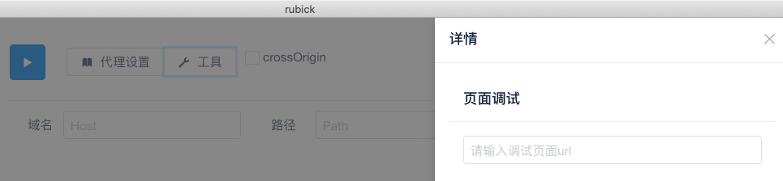
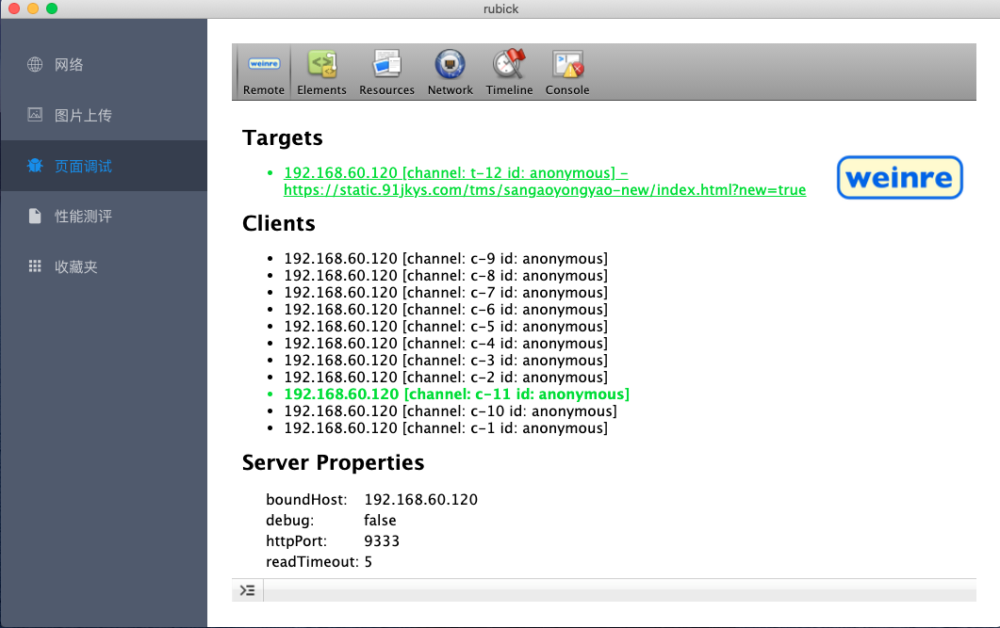
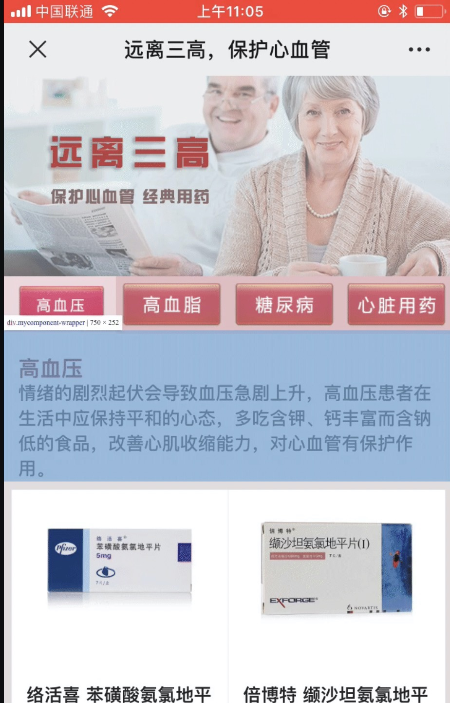

# 页面调试

引入第三方调试工具 weinre， 可以在不连接数据线的情况下快速调试移动端 H5 页面

## 配置

为了更加方便的移动端调试，rubick 内置了 chrome-devtools-frontend，为了和 devtools 建立连接，需要先指定连接页面的 url。这里以 [https://static.91jkys.com/tms/sangaoyongyao-new/index.html?new=true](https://static.91jkys.com/tms/sangaoyongyao-new/index.html?new=true) 为例，我们来远程调试这个页面。首先切换到`网络` 菜单，然后在`工具`页面调试中填写这个 url:

然后打开网络抓包功能，即可建立连接。手机端需要配置网络代理，代理到 `http://{你的电脑ip}:8001`

## 调试

打开手机微信，扫码 https://static.91jkys.com/tms/sangaoyongyao-new/index.html?new=true 这个连接，即可该 url 出现在`Targets`中。点击顶部相应的菜单进入不同操作页面

