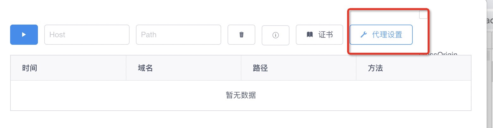
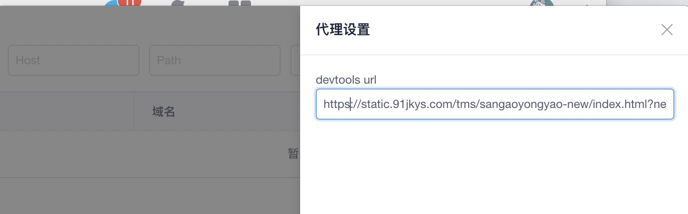
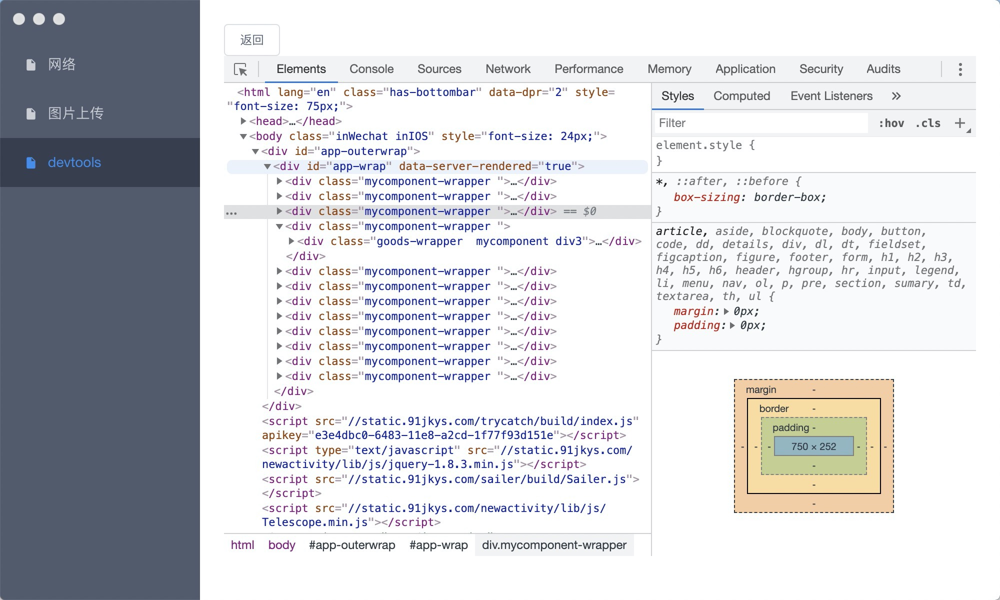

# devtools
## 配置
为了更加方便的移动端调试，rubick 内置了 chrome-devtools-frontend，为了和 devtools 建立连接，需要先指定连接页面的url。
这里以 [https://static.91jkys.com/tms/sangaoyongyao-new/index.html?new=true](https://static.91jkys.com/tms/sangaoyongyao-new/index.html?new=true) 为例，我们来远程调试这个页面。
首先切换到`网络` 菜单，然后在代理配置中填写这个url:

然后打开网络抓包功能，即可建立连接。手机端需要配置网络代理，代理到 `http://{你的电脑ip}:8001` 

## 调试
打开手机微信，扫码 https://static.91jkys.com/tms/sangaoyongyao-new/index.html?new=true 这个连接，即可看到对应的页面
出现在 inspect 中，点击即可进入调试。默认会为开启调试的页面挂载 vconsole

