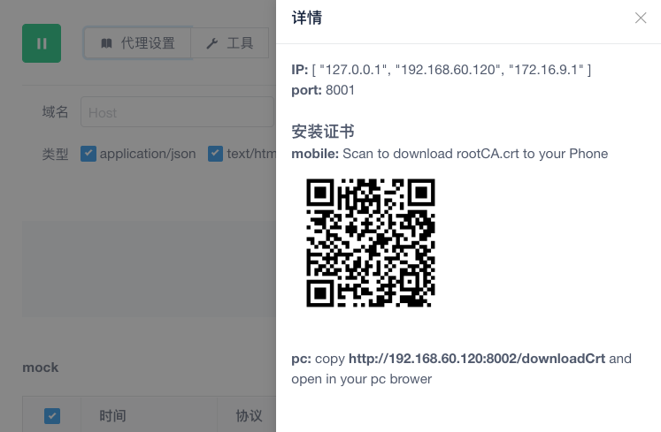

# 环境准备

## 下载 rubick

[安装包地址](https://91jkys.yuque.com/docs/share/a62ebd1b-79a4-40dc-9fee-f5229fd7203d?#)

## 配置代理

下载 chrome SwitchyOmega 插件，转发网页请求到 rubick 客户端 [SwitchyOmega](https://chrome.google.com/webstore/detail/proxy-switchyomega/padekgcemlokbadohgkifijomclgjgif) 下载完成后配置如下： 

开启 SwitchyOmega 后，在浏览器浏览页面，软件就会开始抓包。

## 安装证书

开启网络抓包后，点击 `代理设置` 按钮安装证书。

### pc 端

下载完成后，找到证书安装的目录，双击 rootCA.crt 进行安装 
:::tip 
下载完成后的目录一般在 `/Users/{username}/.anyproxy/certificates`
:::

Mac：安装后在 KeyChain app 中找到证书 AnyProxy, 修改简介为信任。

### 移动端

以 ios 手机为例：

扫码后，点击下载 `cert` 证书证书下载完成后，在 "设置 -> 通用 -> 描述文件与设备管理" 里面信任证书：

 

最后再配置一下局域网的代理

