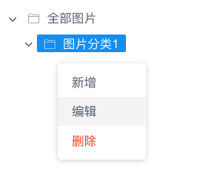
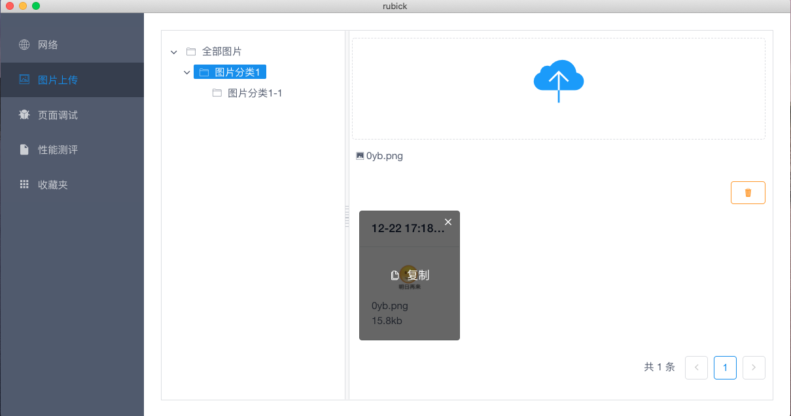
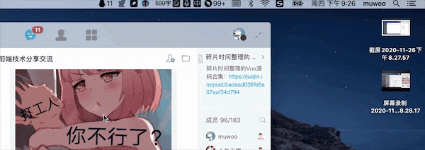

# 图片管理

在某些业务场景中需要将图片存储在 oss 上，通过 url 引用，同时也可对常用的图片进行集中管理（如 logo、favicon ...）

## 图片分类

- 点击右键可以对文件夹进行新增、编辑、删除操作

- 选中某一文件夹进行上传图片将自动归类到该目录下，默认在文件夹`全部图片`下

- 支持对图片进行拖拽归类

- 单击图片卡片可复制图片 url

- 支持单张删除和文件夹清空

## 图片上传

除了在窗口里上传外，也可以直接拖拽到小火箭图标上后自动上传，上传成功后，点击成功的提示消息，即可复制图片上传的链接到剪切板上

## 图片压缩

点击菜单栏上的开启压缩，会使用`imagemin`工具进行自动压缩上传。

