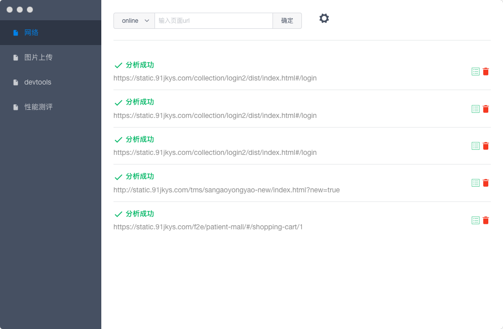
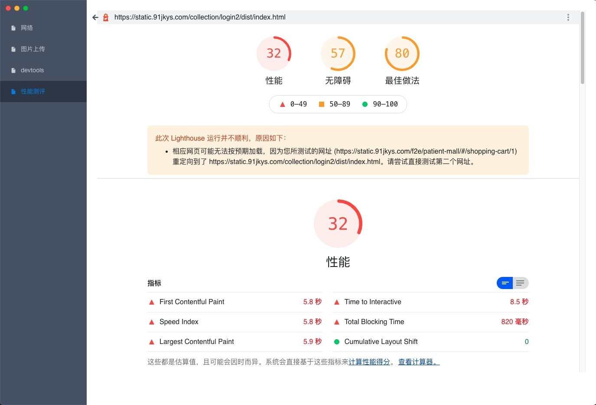

# Lighthouse
Lighthouse 是chrome的一款性能分析工具，可以对页面进行多维度的性能分析和安全性分析，并给出相关改进意见。
::: tip
关于 Lighthouse 的相关性能指标说明可以参考这里：[https://web.dev/learn/#lighthouse](https://web.dev/learn/#lighthouse)
:::

## 网络设置
性能测评左上角可以用来切换网络环境，来测评不同网络的性能指标，目前不支持自定义，核心的网络指标如下：
* online: 无限制
* 3G: 100kb
* 2G: 50kb

## 常规分析
输入页面url，点击确定即可开始对页面进行性能分析。
::: tip
目前不支持多个页面同时进行性能分析，需要一个个进行，只有一个页面分析完成了，另一个页面才可以继续。
:::
点击详情，进入到页面性能分析明细页面：

可以看到页面的分析结果，以及每个指标的评分结果，作为性能分析的参考。

## 高级
对于需要用户登录的页面，我们则需要提前预制用户登录`cookie` 信息，可以点击界面右上角的设置按钮，然后开启需要登录的功能，进行页面登录设置：

这里会模拟用户线上的真实登录。输入手机号验证码后，点击登录，如果登录成功，再进行重新分析即可获取到需要登录页面的性能结果

::: warning
1. 仅支持单用户登录，切换用户时需要切换登录按钮
2. 仅支持线上环境登录，其他环境待完成
:::
