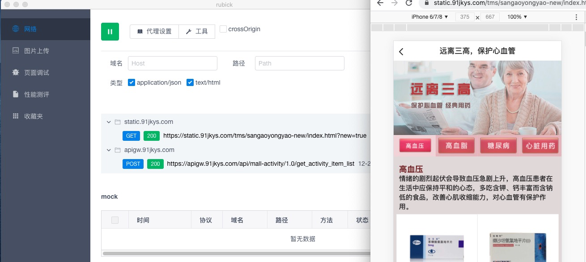
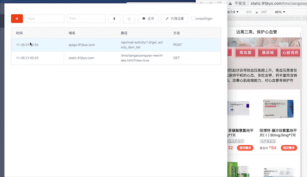
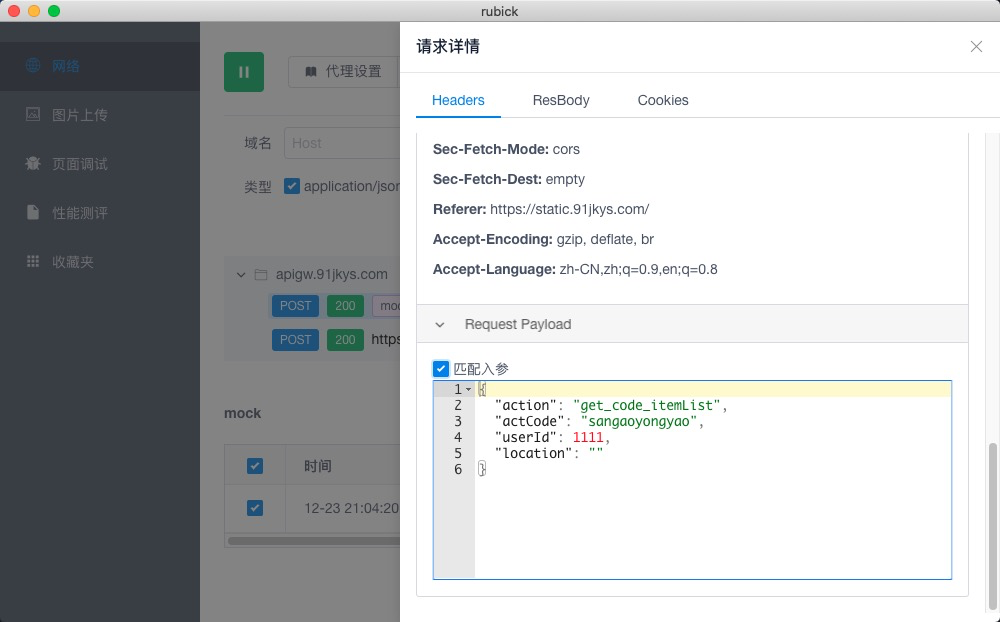
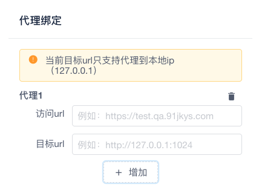

# 网络

## 抓包

点击 :fast_forward: 开始录制网络请求，测试网页中所有的的`['application/json', 'text/html']` 请求将会被默认代理。 

## mock

双击需要 mock 的请求，然后进入 mock 状态，点击 mock 列表里面的请求，进入编辑状态后，即可对对应接口进行 mock 操作。 

### 分场景 mock
假设我们请求了后端同一个接口，但是需要根据入参不同来返回不同的结果，这种情况下怎么处理呢？如果使用 rubick 将会非常方便。直接把需要 mock 的
接口加入到 mock 列表中，然后选择需要分场景 mock 的接口，勾选`匹配参数`选项即可自动根据入参来匹配对于返回结果

## 代理

由于 anyproxy 内部原因，目前只支持代理到本地 ,点击`工具`按钮进入绑定页面

